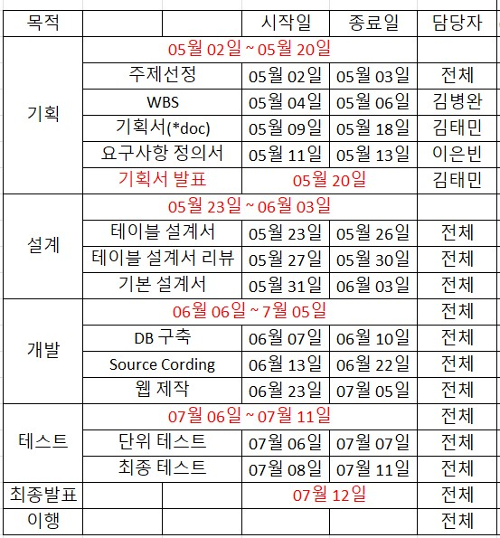

  

# 0. 목차
- Project 목적
- CTRL 팀 소개
- Project 기획
- Project 설계
- 프로젝트 시연
- 사용한 기술

# 1. Project 목적
- 테이블 웨어들을 단순히 그릇에 그치지 않고 인테리어의 한 부분으로 생각하는 사람들을 끌어들이기 위한 고급스럽고 아름다운 홈페이지 구현
- Spring 프레임워크를 사용하여 웹표준 Full-Stack 융합 프로젝트 구현
- Spring MVC아키텍처를 기반으로 Dispatcher-Servlet 원리 이해 
- GitHub 형상관리를 사용하여 조직적 직무수행
- 외부 API 사용(네이버, 아임포트)과 새로운 기능 구현

# 2. CTRL 팀 소개

## 2-1. 담당업무
|이름|담당업무|
|---|:--|
|김주혜|상품 리뷰 기능, 관리자 댓글 기능, 상품 상세페이지|
|김병완|결제 페이지, 결제 기능|
|김태민|장바구니 기능, FAQ 페이지, 공지사항 페이지|
|이은빈|메인 페이지, 로그인, 회원가입, 상품 검색 기능 & 페이지|
|최유빈|카테고리 페이지, 마이페이지(주문조회, 회원정보 조회)|

# 3. Project 기획
2019년 부터 시작된 코로나 바이러스로 인하여 사람들의 외부활동이 위축됨에 따라 외식활동의 횟수는 줄어들고, 집에서 끼니를 해결하는 사람들이 많아져 각종 집을 꾸밀 수 있는 가구, 인테리어 소품들에 대한 수요가 늘어나고 있습니다. 
우리나라의 1인 가구는 전체 가구중 가장많은 31.7% 를 차지하고 있고, 전년대비 8% 증가폭을 보이며 가파르게 상승하고 있다, 또한 이중 이러한 인테리어 소품들에 관심이 많은 20, 30대가 도합 35.9% 로 전체 대비 1, 2위를 차지하고 있어 이러한 구매력이 다소 낮다고 평가되는 2030들도 쉽게 접할 수 있는 쇼핑몰을 생각하던 중 테이블 웨어 쇼핑몰을 생각하게 되었습니다.

해당 웹 페이지를 통해 테이블웨어의 상품을 구매하실 수 있습니다.

# 4. Project 설계

## 4-1. WBS

## 4-2. 요구사항 정의서

## 4-3. EXERD

# 5. 프로젝트 시연

# 6. 사용한 기술

    

